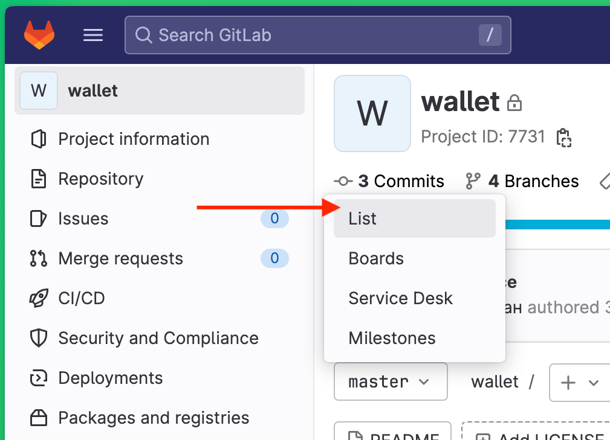
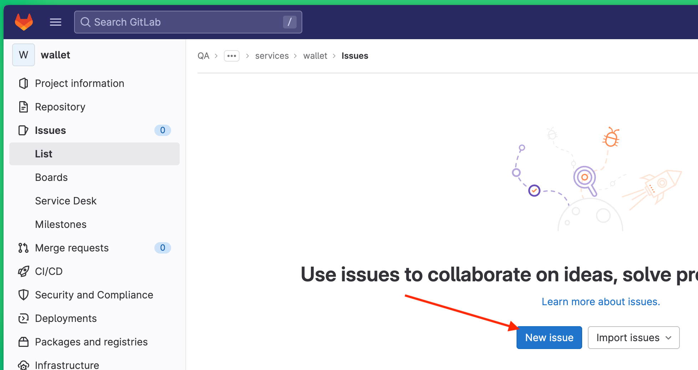
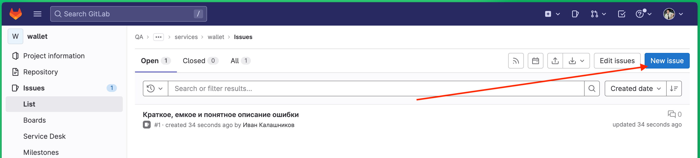
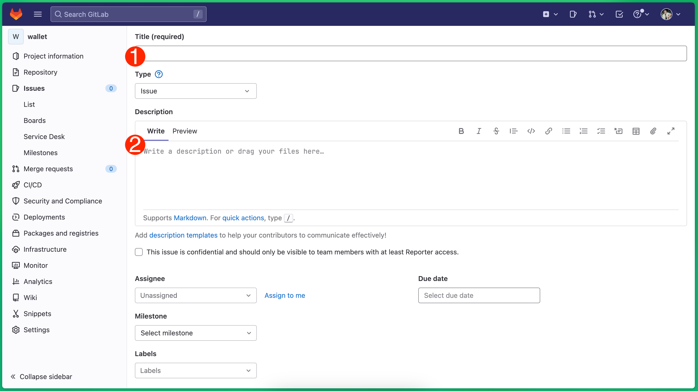
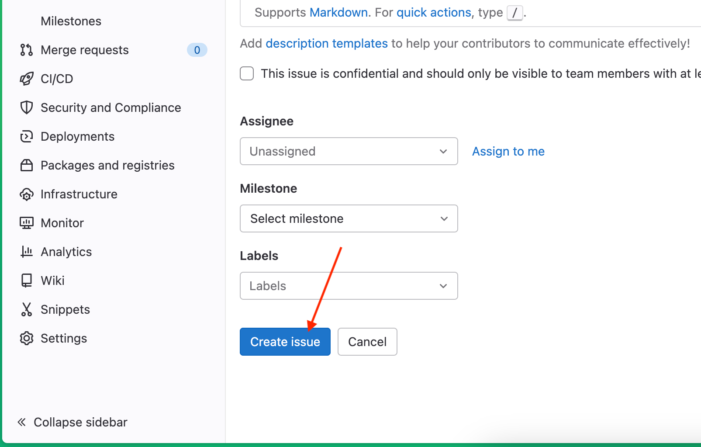

# Руководство для заведения Issue о найденных багах в проекте wallet

1. **Перейдите к списку заведенных Issue.**
В боковом навигационном меню GitLab Issues -> List;

2. **Создайте новый issue по кнопке "New issue".**
Расположение кнопки представлено на скриншотах ниже;

3. **Заполните название (1) и описание (2).**
Воспользуйтесь подсказкой по содержанию полей ниже;

4. **Создайте Issue по кнопке "Create**

5. **Profit!**

# Подсказка по содержанию полей Issue
## Обязательные поля

- **Название (указывается в Title):** краткое, емкое и понятное описание ошибки;
(используйте формулу “Что? Где? Когда?” 3 Ws, WWW - What? Where? When?;)
- **Окружение (Environment):** ссылка на билд/коммит/версия ПО и всего окружения;
- **Шаги воспроизведения (Steps to reproduce):** полный перечень шагов для воспроизведения;
- **Ожидаемый результат (Expected result):** какой результат должен был быть без ошибки;
- **Фактический результат (Actual result):** какой результат получился на самом деле;

## Дополнительные поля, если считаете их необходимыми:
- **Вложения (Attachments):** логи, скриншоты, видео - всё что необходимо для понимания ошибки;
- **Предварительные условия (Prerequisites):** состояние SUT необходимое к началу шагов для воспроизведения; 
- **Тестовые данные (Test Data):** тестовые данные требуемые для воспроизведения;
- **Серьезность дефекта (Defect Severity);**
- **Приоритет дефекта (Defect Priority);**
- **Вероятность возникновения дефекта (Defect Probability);**
- **Комментарии (Remarks);**

## Рекомендации для красивых, уникальных баг-репортов
- Используйте актуальную версию ПО и окружения;
- В одном отчете один баг;
- Перед заведением issue, убедитесь в его воспроизводимости, 2-3 раза;
- Проверьте в списке уже заведенных issue отсутствие отчета о таком же дефекте;
- Постарайтесь локализовать ошибку, чтобы выяснить ее первопричину;
- Пишите подробные шаги и полное окружение для воспроизведения ошибки;
- Следите за словами в процессе создания сообщения об ошибке, они не должны обвинять, оскорблять и/или содержать точку зрения о произошедшем. Сухие факты, по делу;
- Проиллюстрируйте проблему с помощью скриншотов, видео, логов;
- Перед отправкой перепроверьте ваш отчет об ошибке. Дважды)