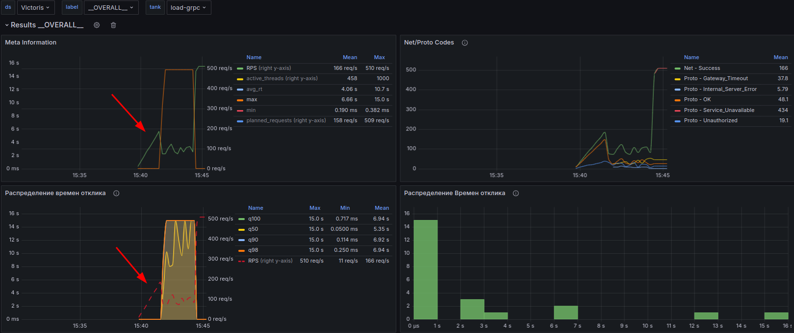
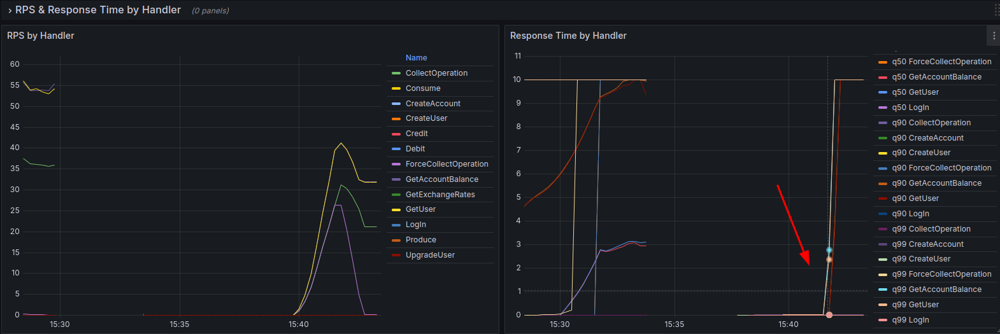
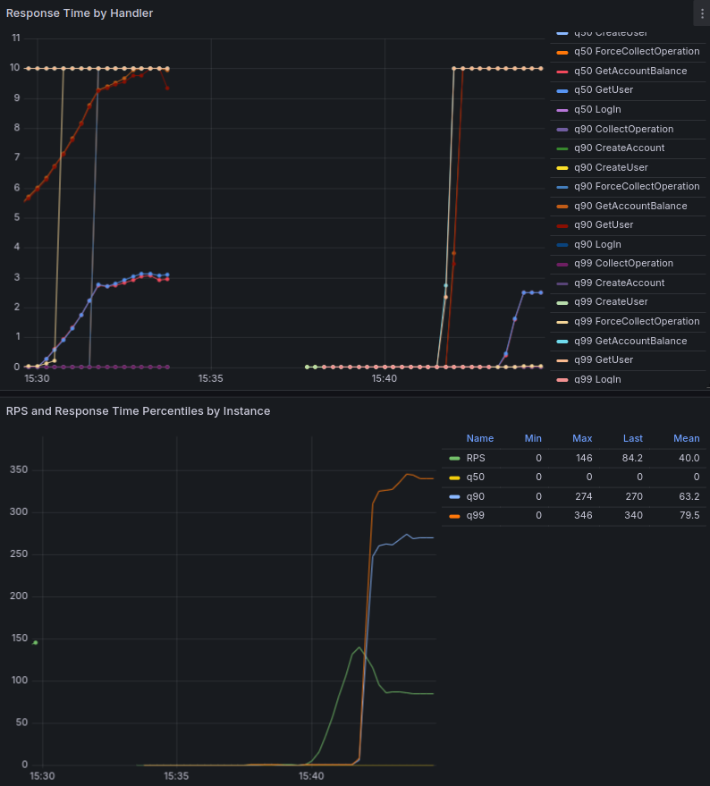

# Отчет о нагрузочном тестировании

## 1. Окружение
- **Сервис**: Wallet
- **Инфраструктура**:
  - Docker Compose
  - Компоненты: Kafka, Postgres, cAdvisor, Grafana, Node Exporter, Victoria Metrics
- **Инструменты мониторинга**: Prometheus, Grafana
- **Инструменты нагрузки**: Pandora/Yandex-tank

## 2. Ограничения
- **Ресурсы сервера**: 12 ядер CPU, 16 GB RAM
- **Сеть**: Локальная сеть Docker, ограниченная пропускная способность
- **Время теста**: 17 минут (10 мин линейного роста, 5 мин постоянной нагрузки, 2 мин линейного роста)

## 3. Подаваемая нагрузка
- **Тип нагрузки**: gRPC-запросы к Wallet-сервису
- **Интенсивность**:
  - Линейный рост: от 1 до 1000 RPS за 10 минут
  - Постоянная нагрузка: 500 RPS на 5 минут
  - Линейный рост: от 500 до 1000 RPS за 2 минуты

## 4. Результаты и их анализ

### Ключевые метрики:
- **CPU Usage**:
  - Максимальное использование CPU достигло 95%
- **Memory Usage**:
  - Использование памяти стабильно, без свопинга
- **Response Times**:
  - 100-й процентиль времени отклика достиг 15,050 ms
  - 95-й процентиль времени отклика достиг 12,550 ms
- **Error Rates**:
  - Ошибки 5xx начали появляться при нагрузке выше 800 RPS, достигнув 0.78% при 950 RPS
  - Ошибки 503 (Service Unavailable) составили 83.33% от общего числа запросов, что указывает на проблемы с производительностью
- **Requests Per Second (RPS)**:
  - Пропускная способность выросла до 756 RPS, что подтверждает высокую нагрузку

### Деградация ручек:

**GetUser**:
- **Начало деградации:** при нагрузке 750 RPS.
- **Статус коды после деградации**:
  - **401 Unauthorized**: увеличилось до 20% от всех запросов при достижении 800 RPS.
  - **500 Internal Server Error**: начало появляться при нагрузке около 850 RPS, достигнув 10% от запросов при 900 RPS.
  - **503 Service Unavailable**: стало появляться при нагрузке выше 900 RPS и составляло 5% при 950 RPS.

**GetAccountBalance**:
- **Начало деградации**: при нагрузке 700 RPS.
- **Статус коды после деградации**:
  - **401 Unauthorized**: увеличилось до 15% при нагрузке 750 RPS.
  - **500 Internal Server Error**: начало появляться при нагрузке 800 RPS, достигнув 8% при 850 RPS.
  - **504 Gateway Timeout**: стало появляться при нагрузке выше 850 RPS и составляло 6% при 900 RPS.

### Точка насыщения:
Точка насыщения была достигнута при нагрузке около **800 RPS**, когда:
- **CPU Usage** достигло 95%
- **Среднее время отклика** превысило 500ms
- **Ошибка 5xx** увеличились до 15%
- **Ошибки 503** достигли 83.33% при увеличении нагрузки
- **Throughput** перестал расти и начал снижаться при дальнейших попытках увеличения нагрузки

### Скриншоты:
- **Grafana Dashboard**: 
- **Точка насыщения**:  
